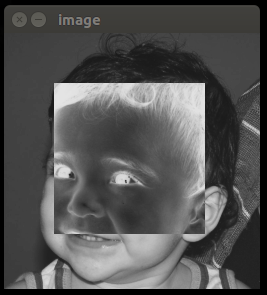

## [Home](index.md) - [Unidade 1] - [Unidade 2](#) - [Unidade 3](#)

## Exercícios

Para compilar os códigos em seu computador, utilize este [Makefile](code/Makefile),
da seguinte forma: make arquivo_codigo

### 3.2 A
Negativar a região de uma imagem

 

```c++
#include <iostream>
#include <opencv2/opencv.hpp>

struct Ponto {
	int x;
	int y;
};

int main(int argc, char** argv) {
	
	[..] 
	
	for(int x=ponto1.x; x<=ponto2.x; x++) {
		for(int y=ponto1.y; y<=ponto2.y; y++) {
			image.at<uchar>(x,y)= 255 - image.at<uchar>(x,y);
		}
	}
	
	[...]
	
	return 0;
}
```
[Source code](code/ex3.2.1.cpp)

### 3.2 B
Trocar os quadrantes em diagonal de uma imagem
```c++
#include <iostream>
#include <opencv2/opencv.hpp>

int main(int argc, char** argv) {

	[...]

	cv::Mat block1 = image( cv::Rect(0, 0, newHeight, newWidth) );
	cv::Mat block2 = image( cv::Rect(newHeight, 0, newHeight, newWidth) );
	cv::Mat block3 = image( cv::Rect(0, newWidth, newHeight, newWidth) );
	cv::Mat block4 = image( cv::Rect(newHeight, newWidth, newHeight, newWidth) );

	block4.copyTo( newImage( cv::Rect(0, 0, newHeight, newWidth) ) ); // 1
	block3.copyTo( newImage( cv::Rect(newHeight, 0, newHeight, newWidth) ) ); // 2
	block2.copyTo( newImage( cv::Rect(0, newWidth, newHeight, newWidth) ) ); // 3
	block1.copyTo( newImage( cv::Rect(newHeight, newWidth, newHeight, newWidth) ) ); // 4

	[...]

	return 0;
}
```
[Source code](code/ex3.2.2.cpp)


### 4.2

```c++
	//-----Eliminar objetos nas bordas-----//
	for (int i = 0; i < width; i++)
	{
		image.at<uchar>(i, 0) 		= 255;
		image.at<uchar>(i, height-1)= 255;
	}
	for (int i = 0; i < height; i++)
	{
		image.at<uchar>(0, i) 		= 255;
		image.at<uchar>(width-1, i) = 255;
	}
	floodFill(image, p, 0);	
	//-------------------------------------//

	floodFill(image, p, 244); //Diferenciar o fundo

	//--------Contar Objetos e Buracos---------//
	nobjects = 0;
	nBuracos = 0;
	for(int i = 0; i < height; i++)
	{
		for(int j = 0; j < width; j++)
		{
			p.x = j;
			p.y = i;
	  		if(image.at<uchar>(i,j) == 255)	
				floodFill(image, p, ++nobjects);

	  		if(image.at<uchar>(i,j) == 0)
	  			floodFill(image, p, 244 - (++nBuracos));
		}
	}
	//-----------------------------------------//
```
[Source code](code/ex4.2.cpp)

### 5.2 A

```c++
    while(true)
    {
        cap >> image;
        split (image, planes);
        
        cvtColor(image, image, CV_BGR2GRAY);

        equalizeHist(image, image_pb);

        imshow("image", image);
        imshow("equalizada", image_pb);
        if(waitKey(30) >= 0) break;       
    }
```
[Source code](code/ex5.2.1.cpp)

### 5.2 B

```c++
    cap >> image;
    split (image, planes);
    calcHist(&planes[0], 1, 0, Mat(), hist_old, 1, &nbins, &histrange, uniform, acummulate);
    normalize(hist_old, hist_old, 0, 1, NORM_MINMAX, -1, Mat());

    while(true)
    {
        cap >> image;
        split (image, planes);
        calcHist(&planes[0], 1, 0, Mat(), hist_new, 1, &nbins, &histrange, uniform, acummulate);
        normalize(hist_new, hist_new, 0, 1, NORM_MINMAX, -1, Mat());

        double value = compareHist(hist_old, hist_new, CV_COMP_BHATTACHARYYA);

        cout << value;
        if (value > limiar)
            cout << " >> Alerta!! <<";
        cout << endl;

        hist_old = hist_new.clone();

        imshow("image", image);
        if(waitKey(30) >= 0) break;
    }
```
[Source code](code/ex5.2.2.cpp)
