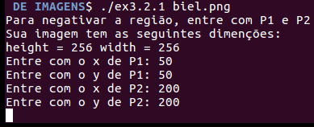
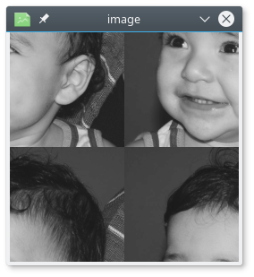
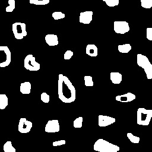
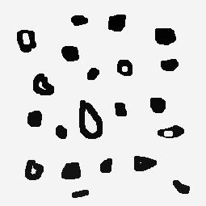
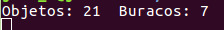
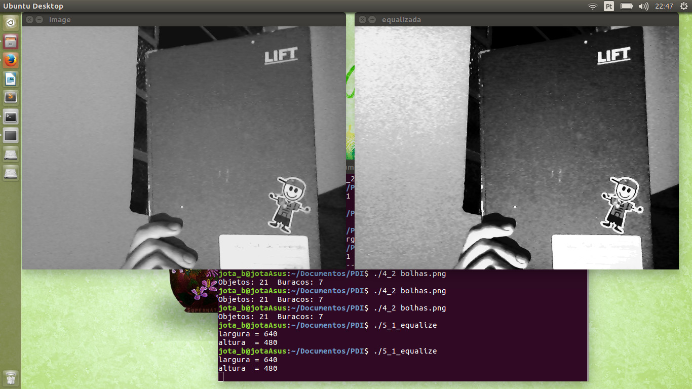
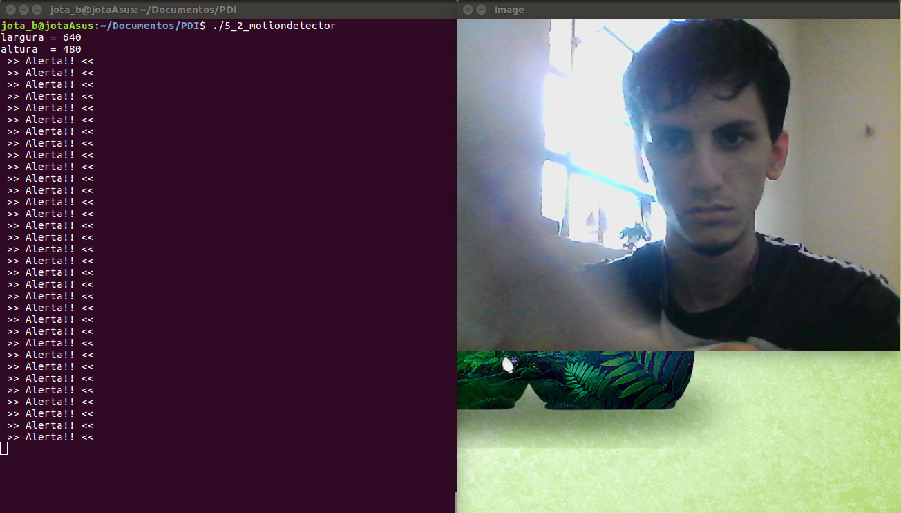
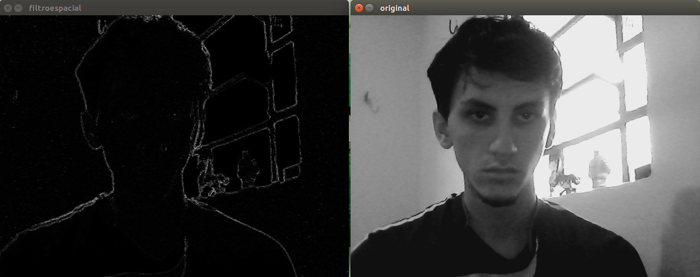

## [Home](index.md) - [Unidade 1] - [Unidade 2](unidade2.md) - [Unidade 3](unidade3.md)

## Exercícios

Para compilar os códigos em seu computador, utilize este [Makefile](code/Makefile),
da seguinte forma: make arquivo_codigo

### 3.2 A
O objetivo desta tarefa é negativar uma região da imagem. Será solicitado o ponto 1 e 2, com isso, a região compreendida irá receber o efeito de negativo, da seguinte forma: PixelValue = 255 - PixelValue.

 

```c++
#include <iostream>
#include <opencv2/opencv.hpp>

struct Ponto {
	int x;
	int y;
};

int main(int argc, char** argv) {
	
	[..] 
	
	for(int x=ponto1.x; x<=ponto2.x; x++) {
		for(int y=ponto1.y; y<=ponto2.y; y++) {
			image.at<uchar>(x,y)= 255 - image.at<uchar>(x,y);
		}
	}
	
	[...]
	
	return 0;
}
```
[Source code](code/uni1/ex3.2.1.cpp)

### 3.2 B
Esta tarefa trata-se de trocar as regiões de uma imagem.



A imagem de entrada é dividida em outras quatro imagens, posteriormente elas são organizadas para formar uma nova composição.
```c++
#include <iostream>
#include <opencv2/opencv.hpp>

int main(int argc, char** argv) {

	[...]

	cv::Mat block1 = image( cv::Rect(0, 0, newHeight, newWidth) );
	cv::Mat block2 = image( cv::Rect(newHeight, 0, newHeight, newWidth) );
	cv::Mat block3 = image( cv::Rect(0, newWidth, newHeight, newWidth) );
	cv::Mat block4 = image( cv::Rect(newHeight, newWidth, newHeight, newWidth) );

	block4.copyTo( newImage( cv::Rect(0, 0, newHeight, newWidth) ) ); // 1
	block3.copyTo( newImage( cv::Rect(newHeight, 0, newHeight, newWidth) ) ); // 2
	block2.copyTo( newImage( cv::Rect(0, newWidth, newHeight, newWidth) ) ); // 3
	block1.copyTo( newImage( cv::Rect(newHeight, newWidth, newHeight, newWidth) ) ); // 4

	[...]

	return 0;
}
```
[Source code](code/uni1/ex3.2.2.cpp)


### 4.2

Essa atividade tem como objetivo, dada uma imagem com vários objetos e entre eles alguns com buracos, encontrar cada objetos e saber quantos são e quantos tem buracos. Porém não podemos contar os objetos que estão recortadas pelas margens, pois não é possível descrever se tal objeto tem ou não buraco na sua real forma.



Para solução de tal problema primeiramente tratamos de eliminar os objetos das bordas, já que eles não serão contados, simplesmente pintando todas as linhas de margens com a cor de objeto para em seguida pintar a partir do ponto [0,0] todos que houverem a mesma cor desse ponto. 

Depois temos que obter uma forma de manipular a imagem para podermos encontrar os buracos. Para tal nós usamos o ponto [0,0], no qual já sabemos que pertence ao fundo, e pintamos todo o fundo de uma cor diferente, pois assim ao encontrar um ponto com a antiga cor de fundo saberemos que ali é um buraco.

Em seguida percorremos toda a imagem e em cada vez que for encontrado um ponto que identifique objeto ou um buraco pintamos toda área com uma cor diferente, sendo uma faixa de cores para cada um, assim contado cada um.




```c++
	//-----Eliminar objetos nas bordas-----//
	for (int i = 0; i < width; i++)
	{
		image.at<uchar>(i, 0) 		= 255;
		image.at<uchar>(i, height-1)= 255;
	}
	for (int i = 0; i < height; i++)
	{
		image.at<uchar>(0, i) 		= 255;
		image.at<uchar>(width-1, i) = 255;
	}
	floodFill(image, p, 0);	
	//-------------------------------------//

	floodFill(image, p, 244); //Diferenciar o fundo

	//--------Contar Objetos e Buracos---------//
	nobjects = 0;
	nBuracos = 0;
	for(int i = 0; i < height; i++)
	{
		for(int j = 0; j < width; j++)
		{
			p.x = j;
			p.y = i;
	  		if(image.at<uchar>(i,j) == 255)	
				floodFill(image, p, ++nobjects);

	  		if(image.at<uchar>(i,j) == 0)
	  			floodFill(image, p, 244 - (++nBuracos));
		}
	}
	//-----------------------------------------//
```
[Source code](code/uni1/ex4.2.cpp)

### 5.2 A

Esse exercício tem como finalidade capturar múltiplas imagens fazer tratamentos de equalização de histogramas nelas e em seguida exebi-las.

Como solução utilizamos a função equalizeHist, que tem uma array de entrada e uma array de saída filtrada.



```c++
    while(true)
    {
        cap >> image;
        split (image, planes);
        
        cvtColor(image, image, CV_BGR2GRAY);

        equalizeHist(image, image_pb);

        imshow("image", image);
        imshow("equalizada", image_pb);
        if(waitKey(30) >= 0) break;       
    }
```
[Source code](code/uni1/ex5.2.1.cpp)

### 5.2 B

Essa questão propõe implementar um detector de movimento, calculando o histograma continuamente e para comparação de cada um com o calculado logo antes, definir um limiar que nos dirá se a diferença nas imagens e definida por uma detecção de movimento.



```c++
    cap >> image;
    split (image, planes);
    calcHist(&planes[0], 1, 0, Mat(), hist_old, 1, &nbins, &histrange, uniform, acummulate);
    normalize(hist_old, hist_old, 0, 1, NORM_MINMAX, -1, Mat());

    while(true)
    {
        cap >> image;
        split (image, planes);
        calcHist(&planes[0], 1, 0, Mat(), hist_new, 1, &nbins, &histrange, uniform, acummulate);
        normalize(hist_new, hist_new, 0, 1, NORM_MINMAX, -1, Mat());

        double value = compareHist(hist_old, hist_new, CV_COMP_BHATTACHARYYA);

        cout << value;
        if (value > limiar)
            cout << " >> Alerta!! <<";
        cout << endl;

        hist_old = hist_new.clone();

        imshow("image", image);
        if(waitKey(30) >= 0) break;
    }
```
[Source code](code/uni1/ex5.2.2.cpp)

### 6.2

Essa questão propõe adicionar uma função para que seja calculado o laplaciano do gaussiano das imagens capturadas. 



```c++
#include <iostream>
#include <opencv2/opencv.hpp>

using namespace cv;
using namespace std;

void printmask(Mat &m)
{
    for(int i=0; i<m.size().height; i++)
    {
        for(int j=0; j<m.size().width; j++)
            cout << m.at<float>(i,j) << ",";
        cout << endl;
    }
}

void menu(){
    cout << "\npressione a tecla para ativar o filtro: \n"
    "a - calcular modulo\n"
    "m - media\n"
    "g - gauss\n"
    "v - vertical\n"
    "h - horizontal\n"
    "l - laplaciano\n"
    "s - laplaciano do gauss\n"
    "esc - sair\n";
}

int main(int argvc, char** argv){
    VideoCapture video;
    float media[] = {1,1,1,
	       			1,1,1,
				    1,1,1};
    float gauss[] = {1,2,1,
				    2,4,2,
				    1,2,1};
    float horizontal[]={-1,0,1,
					   -2,0,2,
					   -1,0,1};
    float vertical[]={-1,-2,-1,
					   0,0,0,
					   1,2,1};
    float laplacian[]= {0,-1,0,
					   -1,4,-1,
					    0,-1,0};

    Mat cap, frame, frame32f, frameFiltered;
    Mat mask(3,3,CV_32F), mask1, mask2;
    Mat result, result1;
    double width, height, min, max;
    int absolut;
    char key, option = 'x';
  
    video.open(0); 
    if(!video.isOpened())  return -1;

    width = video.get(CV_CAP_PROP_FRAME_WIDTH);
    height = video.get(CV_CAP_PROP_FRAME_HEIGHT);
    std::cout << "largura=" << width << "\n";;
    std::cout << "altura =" << height<< "\n";;

    namedWindow("filtroespacial",1);

    mask = Mat(3, 3, CV_32F, media); 
    scaleAdd(mask, 1/9.0, Mat::zeros(3,3,CV_32F), mask1);
    swap(mask, mask1);
    absolut = 1; // calcs abs of the image

    menu();
    for(;;)
    {
        video >> cap; 
        cvtColor(cap, frame, CV_BGR2GRAY);
        flip(frame, frame, 1);
        imshow("original", frame);
        frame.convertTo(frame32f, CV_32F);
        
        if(option == 's') 
        {
            mask2 = Mat(3, 3, CV_32F, gauss);
            scaleAdd(mask2, 1/16.0, Mat::zeros(3,3,CV_32F), mask1);
            //mask2 = mask1;
            filter2D(frame32f, frameFiltered, frame32f.depth(), mask1, Point(1,1), 0);
        }

        filter2D(frame32f, frameFiltered, frame32f.depth(), mask, Point(1,1), 0);
        if(absolut) frameFiltered = abs(frameFiltered);

        frameFiltered.convertTo(result, CV_8U);
        imshow("filtroespacial", result);
        option = 'x';
        key = (char) waitKey(10);
        if( key == 27 ) break; // esc pressed!
        switch(key)
        {
            case 'a':
	            menu();
                absolut=!absolut;
                break;
            case 'm':
	            menu();
                mask = Mat(3, 3, CV_32F, media);
                scaleAdd(mask, 1/9.0, Mat::zeros(3,3,CV_32F), mask1);
                mask = mask1;
                printmask(mask);
                break;
            case 'g':
	            menu();
                mask = Mat(3, 3, CV_32F, gauss);
                scaleAdd(mask, 1/16.0, Mat::zeros(3,3,CV_32F), mask1);
                mask = mask1;
                printmask(mask);
                break;
            case 'h':
	            menu();
                mask = Mat(3, 3, CV_32F, horizontal);
                printmask(mask);
                break;
            case 'v':
	            menu();
                mask = Mat(3, 3, CV_32F, vertical);
                printmask(mask);
                break;
            case 'l':
	            menu();
                mask = Mat(3, 3, CV_32F, laplacian);
                printmask(mask);
                break;
            case 's':
                menu();
                option = 's';
                mask = Mat(3, 3, CV_32F, laplacian);
                printmask(mask);
            default:
                break;
        }
    }
  return 0;
}
```
[Source code](code/uni1/ex6.2.cpp)

