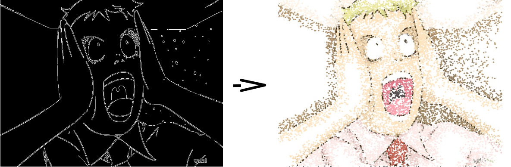
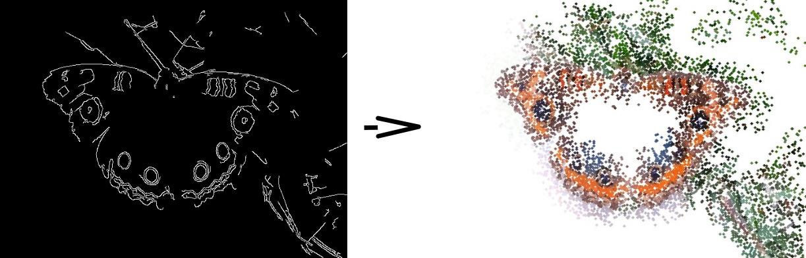

## [Home](index.md) - [Unidade 1](unidade1.md) - [Unidade 2] - [Unidade 3](unidade3.md)

## Exercícios

Para compilar os códigos em seu computador, utilize este [Makefile](code/Makefile),
da seguinte forma: make arquivo_codigo

### 8.2 
O objetivo desta tarefa é implementar um filtro homomórfico para melhorar imagens com iluminação irregular.

Demonstração da aplicação:


Código do filtro:
```c++
void on_filter(int, void*)
{
  float _d0 =    ((float) 2*d0/ (float) MAX_D0) * sqrt( dft_M*dft_M + dft_N*dft_N )/2;
  float _gamaL = ((float) 10*gama_L)/ (float) MAX_GAMA_L;
  float _gamaH = ((float) 10*gama_H)/ (float) MAX_GAMA_H;
  float _c =     ((float) 10*c)/ (float) MAX_C;

  cout << "d0: " << _d0 << "  L: " << _gamaL << "  H: "  << _gamaH << "  c: " << _c << endl;

  double n1, n2;
  double n = 0.0;
  double dGamas = _gamaH - _gamaL;
  double d02 = _d0*_d0;

  for(int i=0; i<dft_M; i++)
  {
    for(int j=0; j<dft_N; j++)
    {
        n1 = (i - dft_M/2)*(i - dft_M/2);
        n2 = (j - dft_N/2)*(j - dft_N/2);
        n = _c * (n1 + n2);

        tmp.at<float>(i,j) = dGamas * (1 - exp(-n/d02)) + _gamaL;
    }
  }

  Mat comps[]= {tmp, tmp};
  merge(comps, 2, filter);
}
```
[Source code](code/uni2/q1.cpp)

### 11.1

Para esse algoritmo utilizou-se duas imagens como teste, uma com traços mais simples e outra com mais detalhes e complexidade em suas cores, mostradas respectivamente:

 

Então, tendo o programa carregado a imagem, primeiramente é criado uma espécie de fundo para imagem. Isso é feito de forma que, simplesmente é percorrida toda a matriz com certos “pulos” ( step ) e assim criando círculos de um tamanho grande o suficiente para que possa preencher todo o fundo. Quanto maior for o step, maior será o raio do círculo nessa etapa e cada um terá a cor do pixel de onde ele se encontra na interação.

Primeira imagem:



Segunda imagem:



São calculados vários filtros de Cannys para limiares diferentes, nesse caso é utilizado valores de 20 à 180, de valores múltiplos de 20. Para cada um desses valores, são criados círculos onde for detectado borda no filtro.                         Esses círculos serão criados com raios de tamanho inversamente proporcionais aos valores de limiares. E cada uma das imagens formadas será adicionada na imagem final.

 


Código da implementação:


```c++
for (top = 20; top < 200; top+=5)
{
	raio =  (200 - top)/10;

	Canny(image, border, top, 3*top);

	random_shuffle(xrange.begin(), xrange.end());  
	
	for(auto i : xrange)
	{
		random_shuffle(yrange.begin(), yrange.end());
		
		for(auto j : yrange)
		{
			if (border.at<uchar>(i,j) == 0) continue;

			x = i+rand()%(2*jitter)-jitter+1;
			y = j+rand()%(2*jitter)-jitter+1;
			
			pix[0] = (int) image.at<Vec3b>(x,y)[2];
			pix[1] = (int) image.at<Vec3b>(x,y)[1];
			pix[2] = (int) image.at<Vec3b>(x,y)[0];

			circle(points, cv::Point(y,x), raio, CV_RGB(pix[0],pix[1],pix[2]), -1, CV_AA);
		}
	}
}
```
[Source code](code/uni2/q2.cpp)
